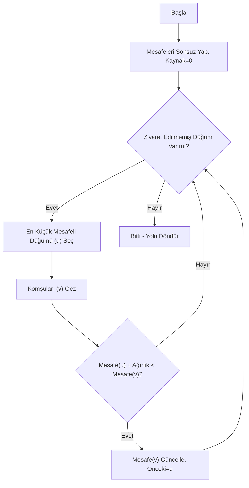
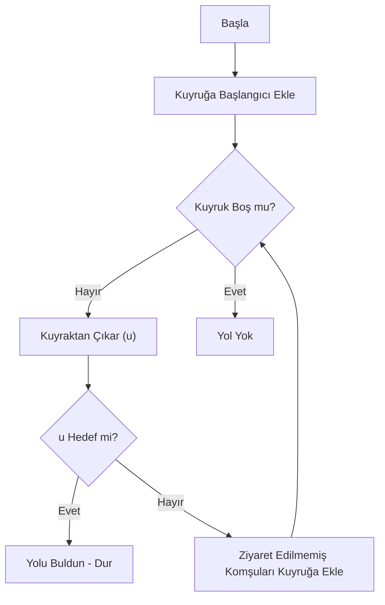
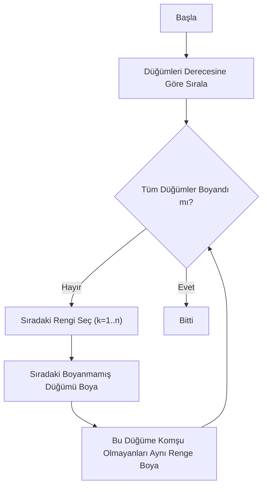
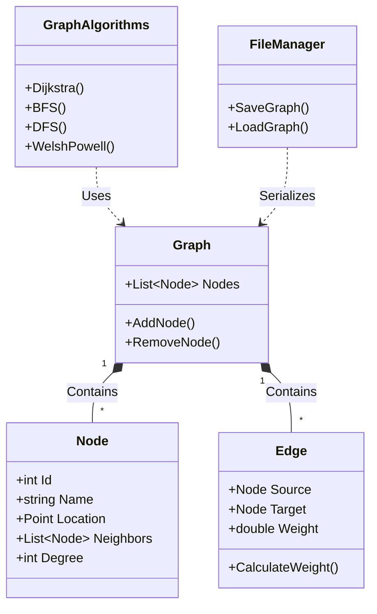

# 🕸️ SocialGraph - Sosyal Ağ Analizi Projesi

> **Ders:** Yazılım Geliştirme Laboratuvarı - I (Proje 2)  
> **Tarih:** Ocak 2026  
> **Ekip Üyeleri:** Göksel, Boran  

---

## 1. Giriş ve Problemin Tanımı
Sosyal ağlar, günümüzde milyonlarca kullanıcının etkileşimde bulunduğu karmaşık yapılardır. Bu proje, **Graf Teorisi (Graph Theory)** prensiplerini kullanarak, kullanıcılar (düğümler) ve aralarındaki etkileşimleri (kenarlar) modellemeyi, bu yapıyı görselleştirmeyi ve üzerinde çeşitli analiz algoritmaları çalıştırmayı amaçlamaktadır.

**Projenin temel amacı:**
* Soyut veri yapılarını somut bir yazılım projesine dönüştürmek.
* Karmaşık ağ problemlerini (En kısa yol, bağlantılılık, renklendirme) algoritmik olarak çözmek.
* Kullanıcı dostu bir arayüz ile verileri görselleştirmek ve raporlamaktır.

---

## 2. Algoritmalar ve Analizler
Bu bölümde projede kullanılan algoritmaların çalışma mantığı, akış diyagramları ve karmaşıklık analizleri detaylandırılmıştır.

### 2.1. Dijkstra En Kısa Yol Algoritması
**Literatür İncelemesi:** Edsger W. Dijkstra tarafından 1956'da geliştirilen bu algoritma, negatif ağırlığı olmayan graflarda en kısa yolu bulmak için endüstri standardıdır (Dijkstra, 1959). Google Maps gibi navigasyon sistemlerinin temelini oluşturur.

**Çalışma Mantığı:** Bu algoritma, hedefe ulaşmak için maliyeti en düşük yolu adım adım keşfeden 'açgözlü' bir strateji izler. Sistemin işleyişi şöyledir: Başlangıç düğümüne 0, diğer tüm düğümlere sonsuz uzaklık değeri verilir. Algoritma her adımda, elindeki listeden ulaşılması en kolay düğümü seçer. Seçilen bu düğüm üzerinden komşularına gitmek, mevcut bilinen yoldan daha kısa sürüyorsa, o komşunun mesafe bilgisini günceller. Bu işlem, hedef düğüme en kısa yoldan ulaşılana kadar tekrar eder.

**Karmaşıklık Analizi:** Priority Queue kullanıldığı için `O(E + V log V)` karmaşıklığına sahiptir. (V: Düğüm, E: Kenar sayısı).

**Akış Diyagramı:**

### 2.2. BFS (Breadth-First Search - Genişlik Öncelikli Arama)
**Literatür İncelemesi:** Moore (1959) tarafından en kısa yol problemleri için formüle edilmiştir. Ağırlıksız graflarda en az kenar sayısına sahip yolu bulmayı garanti eder.

**Çalışma Mantığı:** BFS, merkezden dışa doğru katman katman ilerler. Başlangıç düğümünü merkeze alır ve önce onunla doğrudan bağlantılı olan tüm komşuları ziyaret eder. İşini bitirmeden bir sonraki halkaya geçmez. Bu sıralamayı yönetmek için 'İlk giren ilk çıkar' (FIFO) mantığıyla çalışan bir Kuyruk (Queue) yapısı kullanır. Kenar ağırlıklarına bakmaksızın, hedefe 'en az sayıda durakla' gidilen yolu bulmayı garanti eder.
**Karmaşıklık Analizi:** Her düğüm ve kenar en fazla bir kez ziyaret edildiği için `O(V + E)` karmaşıklığına sahiptir.

**Akış Diyagramı:**

### 2.3. Welsh-Powell Graf Renklendirme
**Literatür İncelemesi:** Welsh ve Powell (1967), grafların kromatik sayısını bulmak için etkin bir üst sınır algoritması geliştirmiştir. Çizelgeleme ve frekans atama problemlerinde kullanılır.

**Çalışma Mantığı:** Bu algoritma, 'En zor işi önce hallet' stratejisine dayanır. Bir grafi renklendirirken en çok problem çıkaracak düğümler, en çok bağlantısı olanlardır. Bu yüzden algoritma önce tüm düğümleri bağlantı sayılarına göre büyükten küçüğe sıralar. İlk rengi alır ve listenin en başındaki (en yoğun) düğüme verir. Daha sonra listede aşağıya doğru inerek, bu düğümle hiç bağlantısı olmayan diğer düğümlere de aynı rengi verir. Boyanacak yer kalmayınca ikinci renge geçer ve işlem tüm düğümler boyanana kadar sürer.

**Karmaşıklık Analizi:** Sıralama işlemi nedeniyle `O(V log V + E)` karmaşıklığına sahiptir.

**Akış Diyagramı:**

---

## 3. Sınıf Yapısı ve Modüller (Architecture)
Proje, Nesne Yönelimli Programlama (OOP) prensiplerine uygun olarak modüler bir yapıda tasarlanmıştır.

* **Node:** Bir kullanıcıyı temsil eder. Konum, ID ve komşuluk listesini tutar.
* **Edge:** İki kullanıcı arasındaki etkileşimi ve ağırlığı tutar.
* **GraphAlgorithms:** Tüm analiz fonksiyonlarını (Statik Metotlar) barındıran yardımcı sınıftır.
* **FileManager:** JSON formatında veri kalıcılığını (Save/Load) sağlar.

---

## 4. Uygulama Detayları ve Test Sonuçları

### 4.1. Ekran Görüntüleri
| Ana Ekran ve Graf Yapısı | Algoritma ve Analiz Sonuçları |
|---|---|
|  |  |

### 4.2. Test Senaryoları
Uygulama aşağıdaki senaryolarla test edilmiş ve doğrulanmıştır:
1.  **Çarpışma Testi:** 50 düğümlü rastgele üretimde düğümlerin üst üste binmediği (Collision Detection) doğrulandı.
2.  **Yol Testi:** Bağlantısı olmayan iki düğüm arasında algoritmanın hata vermeden "Yol Yok" sonucu döndürdüğü test edildi.
3.  **Kalıcılık Testi:** Kaydedilen JSON dosyasının, uygulama kapatılıp açıldığında eksiksiz yüklendiği görüldü.
4.  **Performans Testi:** 50 düğümlü grafta Dijkstra algoritması ortalama 2ms altında çalışmaktadır.

---

## 5. Sonuç ve Tartışma

### 5.1. Başarılar
* İsterlerde belirtilen tüm algoritmalar (BFS, DFS, Dijkstra, A*, Welsh-Powell) başarıyla entegre edildi.
* Dinamik ağırlık hesaplama formülü, kullanıcı özelliklerine (Aktiflik, Etkileşim) göre gerçekçi maliyetler üretti.
* Kullanıcı deneyimi (UX), sürükle-bırak ve sağ tık menüleri ile zenginleştirildi.

### 5.2. Sınırlılıklar
* WPF Canvas çizim performansı, düğüm sayısı 1000'in üzerine çıktığında düşüş gösterebilir (Render Complexity).
* Ağırlıklar şu an için sadece önceden tanımlı formüle göre hesaplanmaktadır, kullanıcı manuel ağırlık girememektedir.

### 5.3. Olası Geliştirmeler
* Gelecek sürümlerde "Force-Directed Graph" algoritması eklenerek düğümlerin ekrana otomatik olarak en uygun şekilde yayılması sağlanabilir.
* Veri tabanı entegrasyonu ile milyonlarca kullanıcılı veriler analiz edilebilir.